# Execution Plan — AI Workshop

## Detailed Analysis Summary

### Change Impact Assessment
- **User-facing changes**: Yes — PR/Issue 自动化操作直接影响 GitHub 用户体验
- **Structural changes**: Yes — 全新系统架构，多模块设计
- **Data model changes**: Yes — TiDB Cloud Zero 审计表设计
- **API changes**: N/A — 不对外暴露 API，通过 gh CLI 与 GitHub 交互
- **NFR impact**: Yes — 安全审计、错误处理、可观测性

### Risk Assessment
- **Risk Level**: Medium — 新项目，但涉及外部系统交互（GitHub、TiDB）
- **Rollback Complexity**: Easy — Greenfield 项目，无遗留系统依赖
- **Testing Complexity**: Moderate — 需要 GitHub API 交互测试和数据库集成测试

## Workflow Visualization

```mermaid
flowchart TD
    Start(["User Request"])

    subgraph INCEPTION["INCEPTION PHASE"]
        WD["Workspace Detection<br/>COMPLETED"]
        RA["Requirements Analysis<br/>COMPLETED"]
        US["User Stories<br/>COMPLETED"]
        WP["Workflow Planning<br/>COMPLETED"]
        AD["Application Design<br/>EXECUTE"]
        UG["Units Generation<br/>EXECUTE"]
    end

    subgraph CONSTRUCTION["CONSTRUCTION PHASE"]
        FD["Functional Design<br/>EXECUTE"]
        NFRA["NFR Requirements<br/>EXECUTE"]
        NFRD["NFR Design<br/>EXECUTE"]
        CG["Code Generation<br/>EXECUTE"]
        BT["Build and Test<br/>EXECUTE"]
    end

    Start --> WD
    WD --> RA
    RA --> US
    US --> WP
    WP --> AD
    AD --> UG
    UG --> FD
    FD --> NFRA
    NFRA --> NFRD
    NFRD --> CG
    CG --> BT
    BT --> End(["Complete"])

    style WD fill:#4CAF50,stroke:#1B5E20,stroke-width:3px,color:#fff
    style RA fill:#4CAF50,stroke:#1B5E20,stroke-width:3px,color:#fff
    style US fill:#4CAF50,stroke:#1B5E20,stroke-width:3px,color:#fff
    style WP fill:#4CAF50,stroke:#1B5E20,stroke-width:3px,color:#fff
    style AD fill:#FFA726,stroke:#E65100,stroke-width:3px,stroke-dasharray: 5 5,color:#000
    style UG fill:#FFA726,stroke:#E65100,stroke-width:3px,stroke-dasharray: 5 5,color:#000
    style FD fill:#FFA726,stroke:#E65100,stroke-width:3px,stroke-dasharray: 5 5,color:#000
    style NFRA fill:#FFA726,stroke:#E65100,stroke-width:3px,stroke-dasharray: 5 5,color:#000
    style NFRD fill:#FFA726,stroke:#E65100,stroke-width:3px,stroke-dasharray: 5 5,color:#000
    style CG fill:#4CAF50,stroke:#1B5E20,stroke-width:3px,color:#fff
    style BT fill:#4CAF50,stroke:#1B5E20,stroke-width:3px,color:#fff
    style INCEPTION fill:#BBDEFB,stroke:#1565C0,stroke-width:3px,color:#000
    style CONSTRUCTION fill:#C8E6C9,stroke:#2E7D32,stroke-width:3px,color:#000
    style Start fill:#CE93D8,stroke:#6A1B9A,stroke-width:3px,color:#000
    style End fill:#CE93D8,stroke:#6A1B9A,stroke-width:3px,color:#000
    linkStyle default stroke:#333,stroke-width:2px
```



### Text Alternative
```
INCEPTION PHASE:
  1. Workspace Detection     — COMPLETED
  2. Requirements Analysis   — COMPLETED
  3. User Stories             — COMPLETED
  4. Workflow Planning        — COMPLETED
  5. Application Design      — EXECUTE
  6. Units Generation        — EXECUTE

CONSTRUCTION PHASE:
  7. Functional Design       — EXECUTE (per unit)
  8. NFR Requirements        — EXECUTE (per unit)
  9. NFR Design              — EXECUTE (per unit)
  10. Code Generation        — EXECUTE (per unit)
  11. Build and Test         — EXECUTE
```

## Phases to Execute

### INCEPTION PHASE
- [x] Workspace Detection (COMPLETED)
- [x] Requirements Analysis (COMPLETED)
- [x] User Stories (COMPLETED)
- [x] Workflow Planning (COMPLETED)
- [ ] Application Design — EXECUTE
  - **Rationale**: 新系统需要定义组件边界、服务层设计、模块间依赖
- [ ] Units Generation — EXECUTE
  - **Rationale**: 多功能模块需要分解为独立的工作单元以支持并行开发

### CONSTRUCTION PHASE (Per Unit)
- [ ] Functional Design — EXECUTE
  - **Rationale**: 每个模块有复杂的业务逻辑（SPAM 检测、PR Review 规则、标签分类）
- [ ] NFR Requirements — EXECUTE
  - **Rationale**: 安全审计、错误处理、TLS 连接等 NFR 需求需要明确
- [ ] NFR Design — EXECUTE
  - **Rationale**: NFR 模式需要融入架构设计（结构化日志、全局错误处理、重试机制）
- [ ] Infrastructure Design — SKIP
  - **Rationale**: 本地 Node.js 服务 + TiDB Cloud Zero，无需复杂基础设施设计
- [ ] Code Generation — EXECUTE (ALWAYS)
  - **Rationale**: 核心实现阶段
- [ ] Build and Test — EXECUTE (ALWAYS)
  - **Rationale**: 构建、测试、验收

### Skipped Stages
- Reverse Engineering — SKIP (Greenfield 项目)
- Infrastructure Design — SKIP (无复杂基础设施需求)

## Success Criteria
- **Primary Goal**: 可运行的 Node.js 服务，自动执行 PR Review、Issue 回复/SPAM/打标，审计日志写入 TiDB
- **Key Deliverables**: 源代码、规则文件、数据库 schema、测试用例、运维文档
- **Quality Gates**: 验收测试通过（AC-01 至 AC-04）、SECURITY-01 至 SECURITY-15 合规
